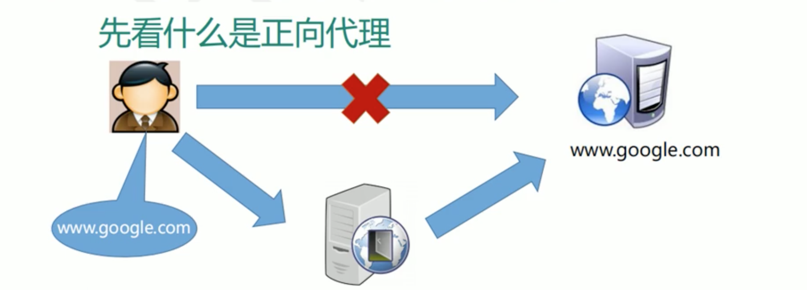
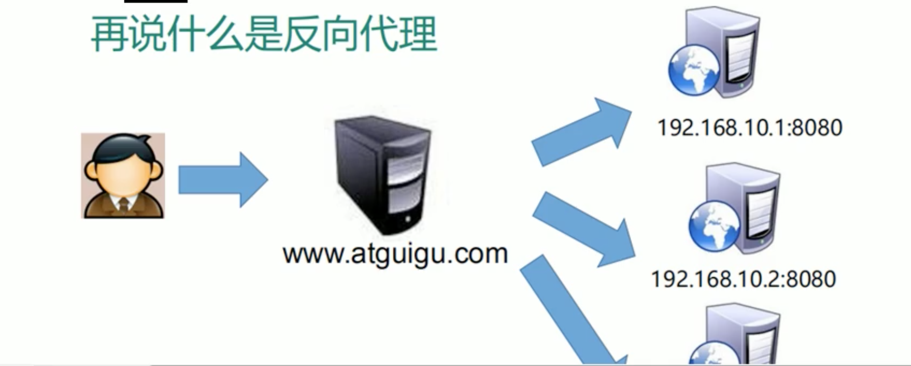
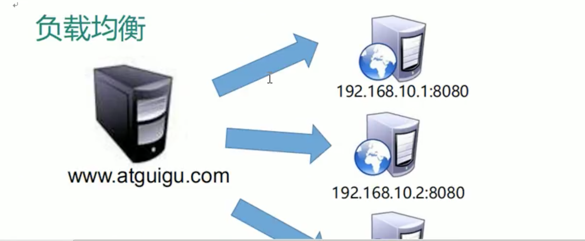
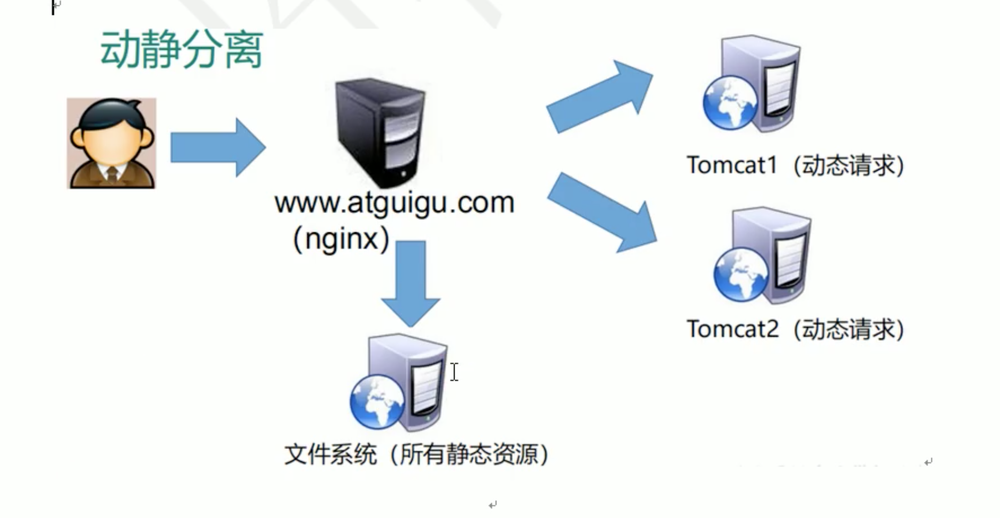

# 2. nginx相关概念

## 2.1 正向代理
### 概念

在客户端(浏览器)配置代理服务器，通过代理服务器进行互联网访问。

## 2.2 反向代理
### 概念

反向代理服务器 根据配置 选择 目标服务器获取数据后，再返回给客户端，此时反向代理服务器和目标服务器对外就是1个服务器，暴露的是代理服务器IP，隐藏了真实服务器IP。

客户端对反向代理是无感的，因为客户端不需要任何配置就可以访问，只需要将请求发送到反向代理服务器。

## 2.3 负载均衡

### 现有 C/S交互方式
客户端发送多个请求到服务器，服务器处理请求，有一些可能要和数据库进行交互，服务器处理完毕后，再将结果返回给客户端。

这种架构模式相对单一，并发请求少的情况下比较合适，成本也低。

但是随着信息数量的不断增长，访问量和数据量飞速增长，以及系统业务的复杂度增加，这种架构会造成服务器响应客户端的请求日益缓慢，并发量特别大，还容易导致崩溃。

* 纵向解决问题: 升级服务配置

首先想到的是: **升级服务器配置**，如提高CPU执行频率，加大内存等。

但是 摩尔定律日益失效，硬件性能提升已经不能满足日益提升的需求了。

* 横向解决问题: 增加服务器数量

### 负载均衡概念

单个服务器解决不了，就增加服务器数量，然后将请求分发到各个服务器上，将原先请求集中到单个服务器情况 改为 将请求分发到多个服务器上，将负载分发到不同服务器，即 **负载均衡**。

## 2.4 动静分离
### 概念
为了加快网站的解析速度，可以把动态页面和静态页面由不同服务器来解析，加快解析速度，降低原来单个服务器的压力。

