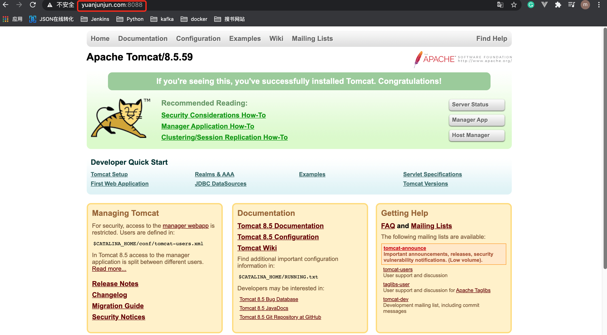
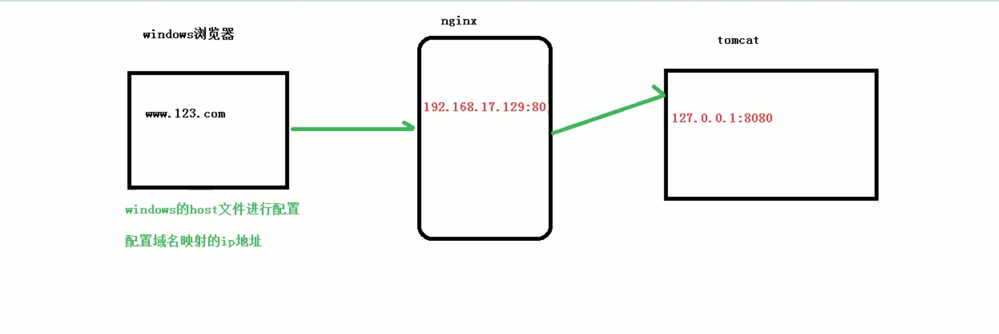

# 1. 反向代理: tomcat服务
## 1.1 实现效果

打开浏览器，在浏览器地址栏输入地址 www.123.com，跳转到 linux tomcat(端口8088)主页面。

## 1.2 准备工作
**1.在linux系统安装 tomcat，启动使用 默认端口8088**

**2.对外开放 8088端口**   
```shell script
# 查看开放的所有端口
firewall-cmd --list-ports

# 添加8088端口
firewall-cmd --add-port=8088/tcp --permanent
firewall-cmd --reload
```

**3.浏览器查看服务器8088端口**




**4.tomcat访问过程**




## 1.3 具体配置
* 1.windows系统 host文件 或mac系统的 /etc/hosts 文件进行 域名 和 ip对应关系 配置

```shell script
# mac系统 hosts文件追加
# new line for http study
47.52.73.65       www.123.com
```
* 2.nginx进行请求转发的配置(反向代理配置)
```shell script
http {
    ...

    server {
        listen       80;
        server_name  localhost;

        #charset koi8-r;

        #access_log  logs/host.access.log  main;

        location / {
            root   html;
            proxy_pass http://127.0.0.1:8080;
            index  index.html index.htm;
        }
    ...
}

```

* 3.重启 nginx
```shell script
[root@www ~] cd /usr/local/nginx/sbin
[root@www sbin]# ./nginx -s reload
```
