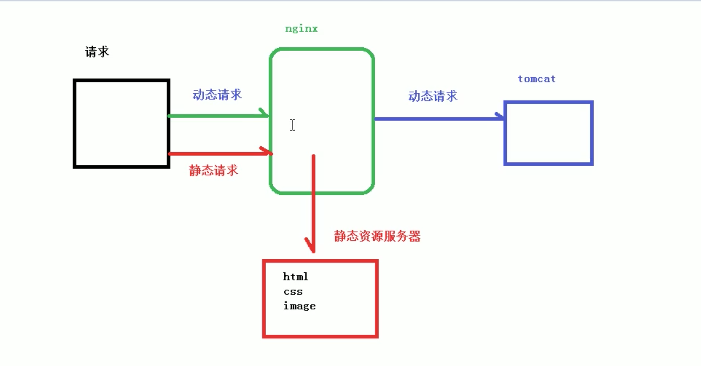

# 7. 动静分离总结

## 7.1 动静分离概念

nginx动静分离简单来说，就是把动态请求 和 静态请求分开，可以理解成用 nginx处理静态页面，Tomcat处理动态页面。

## 7.2 动静分离 实现方式
动静分离 从实现方式来看大致分为 2种:
* 1.纯粹把 静态文件 独立成 单独的域名，放在独立服务器上(**主流方案**)
* 2.动态文件与静态文件混合在一起发布，通过 nginx来分开

### location
通过 location指定不同的后缀名 实现 不同的请求转发

### expires
通过 expires参数设置浏览器缓存过期时间，减少与服务器之间的请求和流量

**Expire定义:** 给1个资源设定1个过期时间，即无需去服务端验证，直接通过浏览器确认是否过期即可，所以不会产生额外的流量。

`注意`: expires只适用于不经常变动的资源，如果经常更新的文件，不建议用 Expires缓存。

