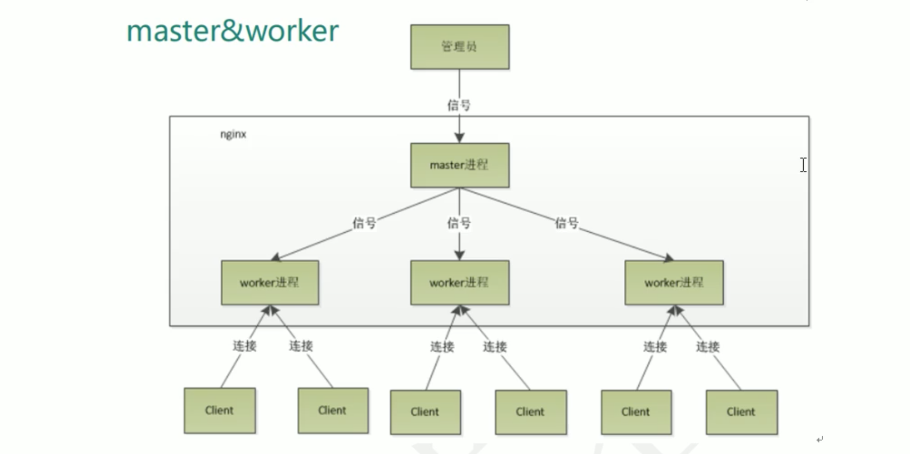
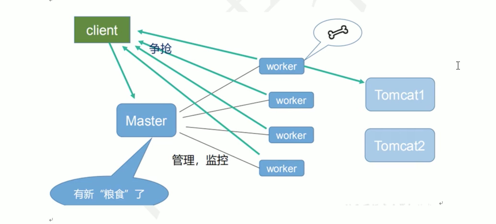

# 1. nginx原理

## 1.1 master 和 worker



```shell script
[root@www ~]# ps -ef | grep nginx
root      5290  5272  0 23:34 pts/1    00:00:00 grep --color=auto nginx
root     27713     1  0 Nov25 ?        00:00:00 nginx: master process ./nginx
nobody   27717 27713  0 Nov25 ?        00:00:00 nginx: worker process
[root@www ~]# 
```

## 1.2 worker 如何进行工作？




## 1.3 1个master、多个worker好处
### master-worker 机制的好处
1.可以使用 `nginx -s reload` 热部署，利于nginx进行热部署操作

2.每个worker是独立的进程，如果其中1个worker出现问题，其他worker继续进行争抢，实现请求过程，不会造成服务中断。

> 首先，对于每个worker进程来说，独立的进程，不需要加锁，所以省掉了锁带来的开销。
>
> 其次，采用独立的进程，可以让互相之间不会影响，1个进程退出后，其他进程还在工作，服务不会中断，master进程则很快启动新的worker进程。
>
> 当然，worker进程的异常退出，肯定是程序有bug，异常退出，会导致当前worker上所有的请求失败，但是不会影响所有的请求，所以降低了风险


## 1.4 需要设置多少个 worker?
nginx同redis类似都采用了 io多路复用机制，每个 worker都是1个独立的进程，但每个进程里只有1个主线程，通过 异步非阻塞 的方式来处理请求，即使是成千上万个请求也不在话下。

每个worker 的线程可以把 1个cpu的性能发挥到极致。所以 worker数 和 服务器的cpu个数相等 是最适宜的。设置少了会浪费cpu，设置多了会容易 cpu造成频繁切换上下文带来的损耗。

`结论`:  worker数 设置为和 服务器的cpu个数相等。

## 1.5 连接数 worker connection

### 问题1: 发送请求，占用了 worker 的几个连接数?

答案: 2个 或 4个。(如果是静态资源，一般是2个，一个client发起的worker链接，1个是worker返回给client，如果是动态资源，一般就是4个，需要连接tomcat)


### 问题2: nginx有1个master、4个worker。每个worker支持最大连接数1024，则支持的最大并发数？

```shell script
最大并发数 = worker_connections * worker_process / 2
```

答: 1024/min(2, 4) * 4 = 2048
